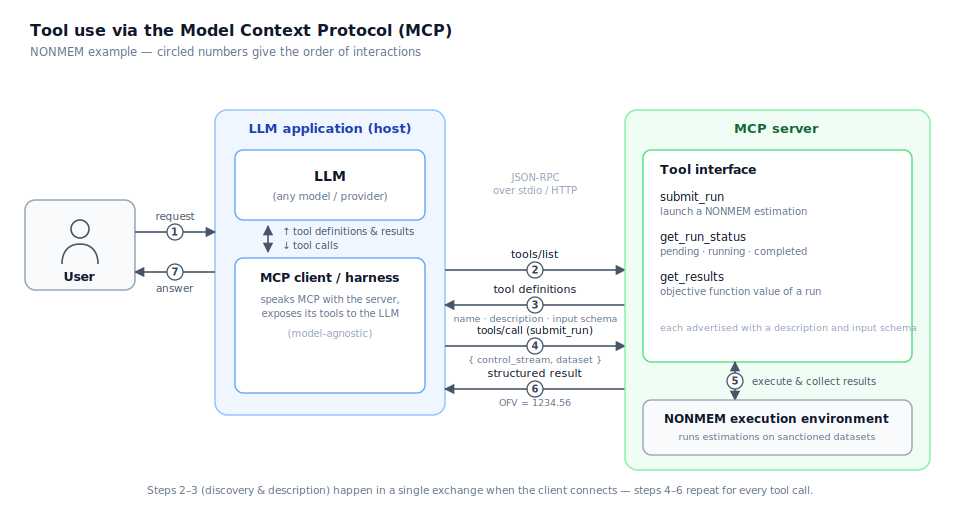

::: {style="font-size: 0.8em; color: #888;"}
Contributors: Marian Klose
:::

> An open standard that lets an AI application talk to external tools and data through one common interface instead of a separate custom integration for each.

## Definition

The Model Context Protocol (MCP) is an open protocol, introduced by Anthropic in late 2024 and now maintained as a community specification, that standardizes how large language model (LLM) applications connect to external [tools](tools.qmd) and data sources. Similar to how USB-C replaces the need for many different cables with one shared standard for connecting devices, MCP provides a common protocol that lets AI applications connect to external systems.

Concretely, MCP sets the rules for how an LLM application (e.g., Claude, ChatGPT) and a server talk to each other when using a tool. The exchanges break down into four parts (simplified):

- **Tool discovery**: The AI application asks: *Which tools do you have?*
- **Tool description**: The MCP server answers: *Here is each tool, what it does, and which inputs it needs.*
- **Tool invocation**: The AI application says: *Run this tool with these arguments.*
- **Tool result**: The MCP server sends the result back in a structured, predictable form after the tool is executed.

Because MCP servers follow the same protocol, MCP-compatible applications can integrate with new tools without writing a custom connector for each one.

](media/mcp/mcp-overview.svg)

## In pharmacometrics

[Tools](tools.qmd) are key for agentic workflows in pharmacometrics, because the LLM itself cannot run NONMEM or R code, nor can it access the datasets and model files that are needed to do so. An MCP server allows a team to wrap these tools and expose them to the LLM in a uniform way, so that the LLM can be used to automate tasks like running NONMEM models or generating exploratory data analysis plots. 


### Example: MCP server exposing a NONMEM run

A pharmacometrics team wraps their NONMEM execution environment in an MCP server that exposes a small set of tools: 

- `submit_run` (takes a control stream and executes the run)
- `get_run_status` (returns the current status of a run, e.g., pending, running, minimization successful, terminated, etc.)
- `get_results` (returns objective function value). 

When an LLM [harness](harness.qmd) is connected to this MCP server, it would first check which tools are available. The harness sends a `tools/list` request to the server:

```json
{ "jsonrpc": "2.0", "id": 1, "method": "tools/list" }
```

The server responds with a machine-readable description of every tool it offers: its name, what it does, and a schema for its inputs:

```json
{
  "jsonrpc": "2.0",
  "id": 1,
  "result": {
    "tools": [
      {
        "name": "submit_run",
        "description": "Launch a NONMEM estimation for a given control stream.",
        "inputSchema": {
          "type": "object",
          "properties": {
            "control_stream": {
              "type": "string",
              "description": "Path to the .mod / .ctl file"
            }
          },
          "required": [
            "control_stream"
          ]
        }
      },
      {
        "name": "get_run_status",
        "description": "Return the current status of a run",
        "inputSchema": {
          "type": "object",
          "properties": {
            "run_id": {
              "type": "string"
            }
          },
          "required": [
            "run_id"
          ]
        }
      },
      {
        "name": "get_results",
        "description": "Return the objective function value of a completed run.",
        "inputSchema": {
          "type": "object",
          "properties": {
            "run_id": {
              "type": "string"
            }
          },
          "required": [
            "run_id"
          ]
        }
      }
    ]
  }
}
```

The harness converts these definitions into the tool-calling format of its LLM API and includes them in the model's context. From that point on, the model can decide on its own to call, say, `submit_run` with a control stream.


If a user then asks the LLM to "run `run042.mod` in NONMEM and give back the OFV", the LLM can reason that it needs to call `submit_run` with the control stream, then poll `get_run_status` until the run is complete, and finally call `get_results` to retrieve the objective function value. The LLM can then return this value to the user:

> The objective function value for `run042.mod` is 1234.56.

The interaction is visualized in the following diagram:



In a properly configured implementation, each action can be logged as a JSON-RPC request/response, making the run traceable.

## Related terms

[Tools](tools.qmd)

## Further reading

- [Model Context Protocol specification](https://modelcontextprotocol.io): the authoritative spec and SDKs.
- [Introducing the Model Context Protocol](https://www.anthropic.com/news/model-context-protocol): the original announcement and motivation.

