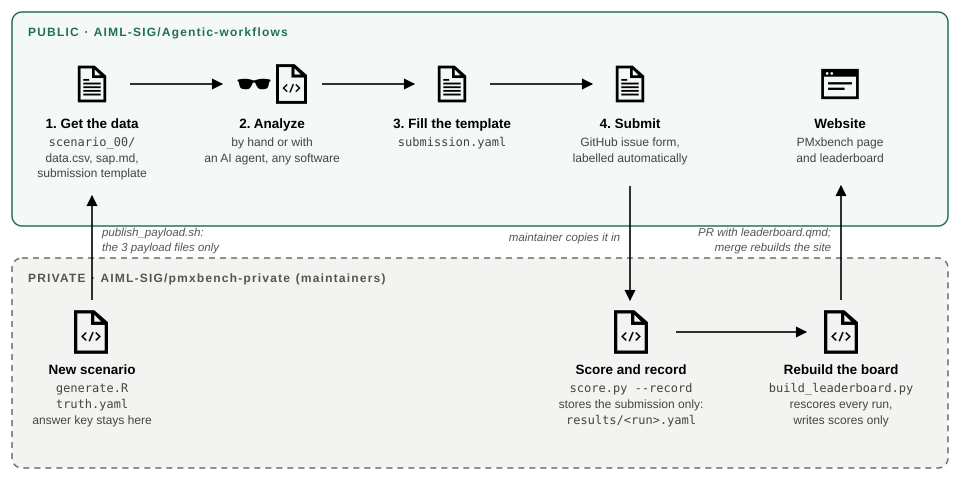

# PMxbench

A synthetic population PK study with a known answer. Analyze it however you like,
by hand or with an AI agent, and submit your answers in one YAML file.

**Start here: [aiml-sig.github.io/Agentic-workflows](https://aiml-sig.github.io/Agentic-workflows/)**



## Three steps

1. **Get the data.** Everything is in [`scenario_00/`](scenario_00/):
   `data.csv`, `sap.md` (protocol and analysis plan), and `submission.template.yaml`.
2. **Run the analysis** that `sap.md` describes, with any software you like.
3. **Submit.** Fill in the template, save it as `submission.yaml`, and paste it into a
   [submission issue](https://github.com/AIML-SIG/Agentic-workflows/issues/new?template=pmxbench-submission.yml).
   We score it and post the result to the
   [leaderboard](https://aiml-sig.github.io/Agentic-workflows/leaderboard.html).

## What's here

```
scenario_00/                 the study you analyze
  data.csv
  sap.md
  submission.template.yaml
template_scenario_00/        the same study, plus how it was built and scored
  data.csv
  sap.md
  submission.template.yaml
  generate.R                 simulates data.csv from a fixed seed (--plots for EDA figures)
  truth.yaml                 the answer key, with the planted traps explained
  score.py                   the scorer: python3 score.py submission.example.yaml
  submission.example.yaml    a deliberately imperfect submission, to see scoring work
```

`template_scenario_00/` shows how every scenario is structured. From
`scenario_01/` on, only the three payload files are published; `generate.R` and
`truth.yaml` stay in a private repo, so the answers can't be looked up.

Contributing a scenario: start from a copy of `template_scenario_00/` and open an
issue. Running agents against scenarios, recording results and building the
leaderboard happen in a private maintainer repo, because they handle answer keys.
